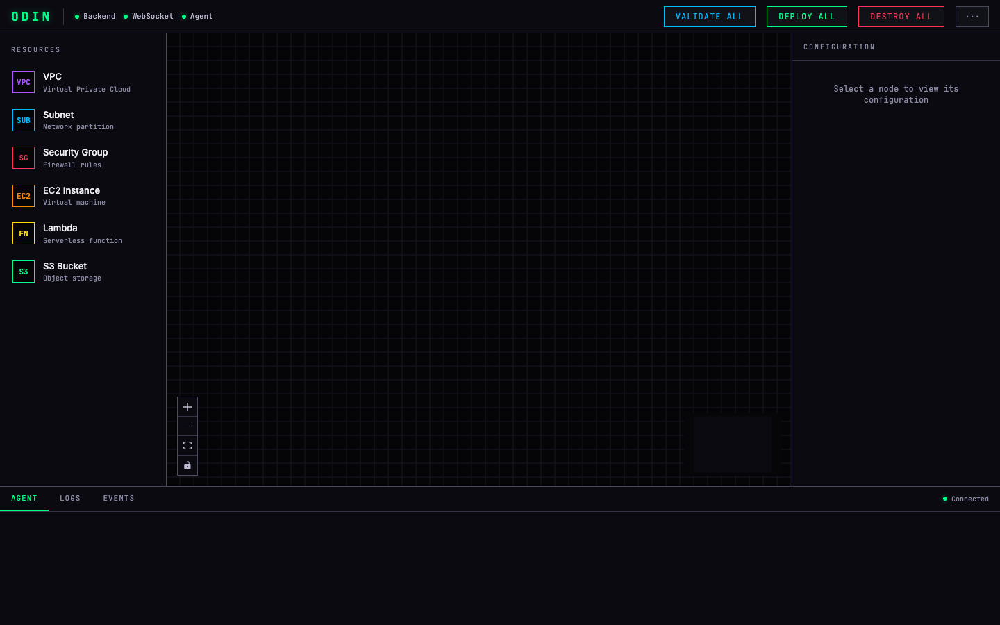

# Odin

[](LICENSE)
[](https://github.com/kessler-frost/odin/actions/workflows/ci.yml)


A visual canvas for AWS, driven by an AI agent and run on your own machine.



You draw your infrastructure on a dark, neon-accented canvas (VPCs, subnets,
EC2, Lambda, S3, security groups). An AI agent turns what you draw into boto3
code, [Moto](https://github.com/getmoto/moto) simulates the AWS APIs locally,
and the canvas lights up with live status as resources validate. You never write
the boilerplate yourself.

## The canvas

- React 19 + [ReactFlow](https://reactflow.dev/) interactive graph: pan, zoom,
  drag-and-drop, connect, undo/redo, multi-select, copy/paste
- High-contrast dark-industrial theme with a neon accent per resource type:
  VPC purple, Subnet blue, EC2 orange, Lambda yellow, S3 green, Security Group red
- Snap-to-grid layout, resizable nodes, collapsible side and bottom panels
- A config panel for editing resource properties and a bottom panel that streams
  the agent's reasoning live over WebSocket

## How it works

```
draw on canvas  ->  agent writes boto3  ->  Moto validates  ->  status back on canvas
                         (Claude Agent SDK)        (local)            (WebSocket)
```

- **UI:** React 19 + ReactFlow + Tailwind CSS v4 (Vite)
- **Backend:** FastAPI + WebSocket, a resource registry, and the Moto simulator
- **Agent:** [Claude Agent SDK](https://github.com/anthropics/claude-agent-sdk-python),
  a single persistent `ClaudeSDKClient` with in-process MCP tools, running on
  Claude Sonnet 4.6 for speed in the agentic loop
- **Real execution (in progress):** EC2 to Lima VMs, Lambda to nerdctl
  containers, and VPC isolation over a Nebula mesh

## Requirements

- Python 3.12+ and [uv](https://github.com/astral-sh/uv)
- [bun](https://bun.sh/) for the UI
- Claude access for the agent (via the Claude Code CLI that the Agent SDK wraps)
- Optional, for real execution: [Lima](https://github.com/lima-vm/lima),
  [Nebula](https://github.com/slackhq/nebula), and a container runtime

## Quick start

```bash
uv tool install --editable ".[dev]"   # install the `odin` CLI

odin start            # build the UI and serve on http://localhost:4200
odin start --dev      # dev mode: Vite HMR + uvicorn reload
```

Then open the canvas in your browser and start drawing.

```
odin start        Build UI + start the server
odin start --dev  Hot-reloading dev server
odin stop         Stop the server
odin status       Show running state
odin clean        Reset local state (odin clean --all wipes everything)
```

## Status

The visual canvas, the AI agent, and the Moto validation pipeline work end to
end. Real deployment (Lima VMs, containers, Nebula networking) is being wired in.
See [ROADMAP.md](ROADMAP.md).

## License

Apache License 2.0. See [LICENSE](LICENSE).
