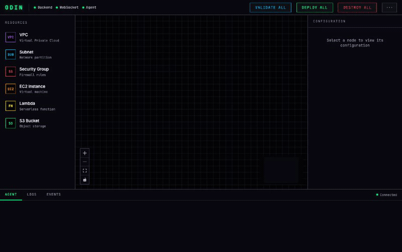

# Odin

[](LICENSE)
[](https://github.com/kessler-frost/odin/actions/workflows/ci.yml)


Odin is a canvas for building and visualizing AWS infrastructure. You arrange the
resources you need (VPCs, subnets, EC2, Lambda, S3, security groups) and see how
they fit together. It also generates the Terraform (OpenTofu) behind what you
draw, and can simulate that against a local Moto server if you want to check it
before anything touches real AWS.



## What it does

- **Build and visualize.** Lay out AWS resources on a canvas and see the shape of
  your infrastructure: what sits inside which VPC or subnet, and what connects to
  what.
- **Generates Terraform.** Odin keeps an OpenTofu configuration in sync with the
  canvas, so you end up with real HCL, not a throwaway diagram.
- **Simulates locally, if you want.** Check the config against a local
  [Moto](https://github.com/getmoto/moto) server with `tofu plan`, or run it with
  `tofu apply`, all without using real AWS.

## How it's built

- **UI:** React 19 + ReactFlow + Tailwind, served by Vite.
- **Backend:** FastAPI + WebSocket and a resource registry, with a local Moto server.
- **Terraform:** written by an agent (the [Claude Agent SDK](https://github.com/anthropics/claude-agent-sdk-python))
  and run with [OpenTofu](https://opentofu.org/).

## Requirements

- Python 3.12+ and [uv](https://github.com/astral-sh/uv)
- [bun](https://bun.sh/) for the UI
- [OpenTofu](https://opentofu.org/) (`tofu`)
- Claude access for the agent (via the Claude Code CLI the Agent SDK wraps)

## Install

Each release ships a wheel with the UI already built in. Grab the wheel URL from
the [latest release](https://github.com/kessler-frost/odin/releases/latest) and:

```bash
uv tool install <wheel-url>
```

Or from a local clone, for development:

```bash
git clone https://github.com/kessler-frost/odin.git
cd odin
uv tool install --editable ".[dev]"
cd ui && bun install
```

## Quick start

```bash
odin start            # build the UI and serve on http://localhost:4200
odin start --dev      # Vite HMR + uvicorn reload
```

```
odin start        Build UI + start the server
odin start --dev  Hot-reloading dev server
odin stop         Stop the server
odin status       Show running state
odin clean        Reset local state (odin clean --all wipes everything)
```

## Status

The canvas, the Terraform generation, and local simulation against Moto work end
to end. A mode that runs resources for real (Lima VMs, containers, Nebula
networking) is planned. See [ROADMAP.md](ROADMAP.md).

## License

Apache License 2.0. See [LICENSE](LICENSE).
