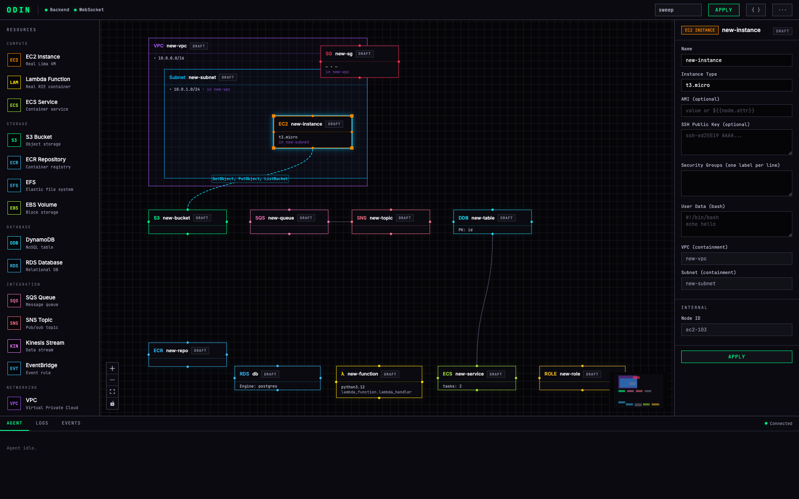
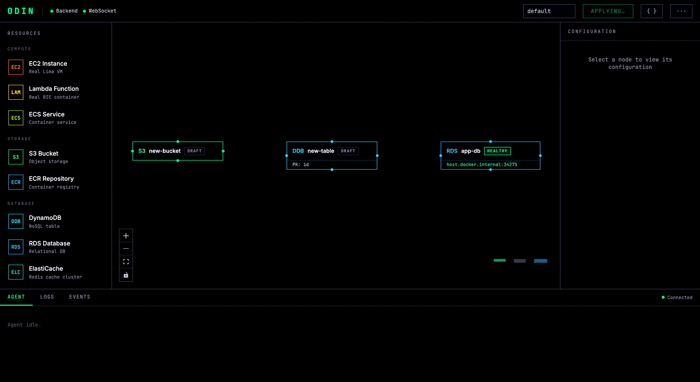
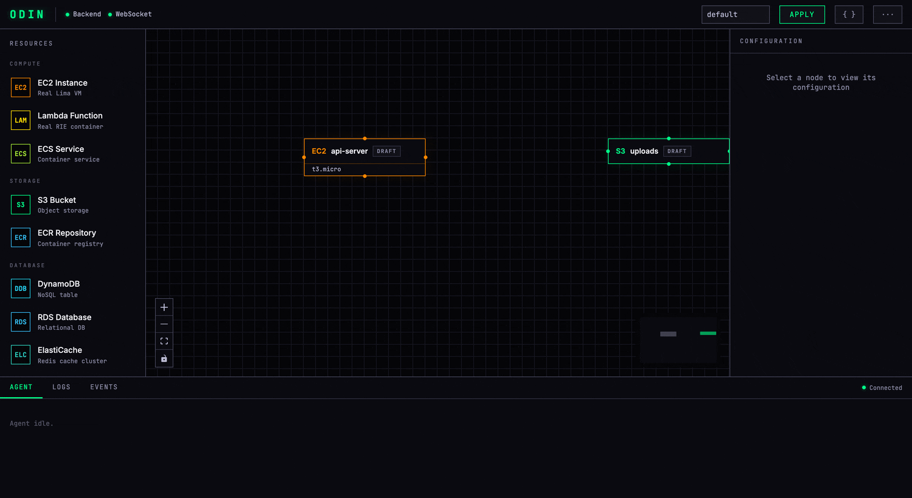
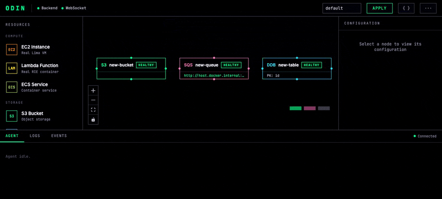

# Odin

[](LICENSE)
[](https://github.com/kessler-frost/odin/actions/workflows/ci.yml)


Draw an AWS architecture on a canvas, press one button, and it runs on your Mac
for real. Odin compiles the canvas to Terraform, runs `tofu apply` against its
own AWS-compatible gateway, and the gateway fulfills every call with a real
local substitute: a real Postgres for RDS, a real Lima VM for EC2, real
containers for ECS and Lambda.

Three things make it different from a mock:

- **The IAM permissions you draw are enforced.** An edge from a Lambda to a
  bucket with `s3:GetObject` checked means that function's key can do exactly
  that. Anything else comes back as a real `AccessDenied` from the gateway, not
  a lint warning.
- **The translation is a compiler, not a prompt.** The same canvas always
  produces byte-identical Terraform, and Terraform reads back into canvas nodes
  the same way every time. No model call sits in that path.
- **It is real execution.** `tofu` really runs, containers really start, and
  when something is broken the resource says so instead of turning green.

[NORTHSTAR.md](NORTHSTAR.md) has the direction; [ROADMAP.md](ROADMAP.md) has
what is next.



**Draw it, press Apply, watch it come up for real.** Three resources placed on the
canvas, applied, and healthy — a real RustFS bucket, a real dynalite table and a
real Postgres container behind those badges, not a mock. The clip runs at
roughly 4x: the apply it records took 103 seconds:



**IAM permissions are edges you draw** — and the canvas updates live when
anything changes it, including the CLI. This clip authors the edge with
`odin canvas set` and the already-open browser converges it with no reload:



**The `{ }` button shows the Terraform that canvas compiles to** — the same
deterministic HCL Apply runs, not a preview of something else:



## Install

macOS with [Homebrew](https://brew.sh). This installs colima, the docker CLI,
opentofu, uv and lima, starts colima, installs odin, and runs `odin doctor`:

```bash
curl -fsSL https://raw.githubusercontent.com/kessler-frost/odin/main/scripts/install.sh | sh
odin start          # serves http://localhost:4200 and backgrounds itself
```

Draw something from the sidebar and press **Apply**. The Events tab streams the
`tofu apply` output, badges go `healthy`, and the `{ }` button shows the
generated Terraform.

To undo the install:

```bash
curl -fsSL https://raw.githubusercontent.com/kessler-frost/odin/main/scripts/uninstall.sh | sh
```

That stops the server, removes this project's odin containers and VMs, deletes
odin's own built images and its `~/.cache/odin` OpenTofu plugin cache, and
uninstalls the tool. Homebrew tools are left alone, and so are your `.odin/` state
directories, whose paths it prints. `--dry-run` shows what it would remove,
`--all-envs` widens the container sweep to every odin container on the machine,
`--images` also removes the third-party backing images odin pulled.

### What it needs

`odin doctor` checks every one of these except the first — running it at all proves
Python and `uv` work — and prints the fix for whatever is missing. A dependency
needed only by one feature is reported as an optional `○` row that names the canvas
or feature it is required for, and the summary line counts those rather than
letting "All required checks passed" stand alone.
`odin doctor --prebake` additionally builds the
[dynalite](https://github.com/mhart/dynalite) image up front, so your first
DynamoDB Apply doesn't wait on a one-time `npm install` inside a container.

| | |
| --- | --- |
| Python 3.12+ and [uv](https://github.com/astral-sh/uv) | odin itself |
| [Colima](https://github.com/abiosoft/colima) | the container runtime |
| the `docker` CLI | a separate formula. `brew deps colima` is just `lima`, so colima alone leaves you without one, and everything in odin shells out to it |
| [OpenTofu](https://opentofu.org/) | Apply runs `tofu` |
| [Lima](https://lima-vm.io/) (`limactl`) | only for a canvas with an **EC2** node, since each one is a real Lima VM |
| [bun](https://bun.sh/) | only to build the UI from a clone; the released package ships one prebuilt |
| [nebula](https://github.com/slackhq/nebula) (`nebula` + `nebula-cert`, one `brew install nebula`) | only for the mesh: `nebula-cert` is needed by **any canvas with a VPC node** (CreateVpc signs that env's CA, and the apply fails without it), and `nebula` runs the lighthouse once the first member joins the mesh — which can be a backing, not only an EC2 VM |

### Three install paths, one `odin` command

There is exactly one global `odin` entrypoint (uv's tool slot) and three ways to
fill it: the script above, the same thing by hand
(`uv tool install "git+https://github.com/kessler-frost/odin.git@latest"`, since
CI fast-forwards `latest` on every tagged release), or a development install that
tracks your working tree. **They overwrite each other.**

```bash
git clone https://github.com/kessler-frost/odin.git && cd odin
uv tool install --editable ".[dev]"
cd ui && bun install     # do this before `odin start`, which builds the UI
```

Replacing one pinned install with another is an upgrade, and the script does it.
Replacing a *development* install would detach `odin` from your checkout, so the
script refuses and tells you to pass `--force` if you meant it.

## What you can do

Everything the canvas does is also a command, so an agent can drive odin too.
Commands that talk to the server take `--url`/`ODIN_URL` (default
`http://localhost:4200`) and `-o json`; `export`, `import` and `keys` work
straight on the filesystem and need no server.

| what | how, from a shell |
| --- | --- |
| Draw and run an architecture. 18 kinds are backed end to end | `odin canvas get` / `odin canvas set f.json`, then `odin apply` |
| Grant permissions by drawing an edge and checking actions | the same canvas JSON; the gateway enforces them |
| Contain things (drag an EC2 into a Subnet into a VPC; nesting is spatial, not a connector) | `data.vpc` / `data.subnet` on the node |
| See the generated Terraform | `odin translate [--file draft.json]`, or the `{ }` button |
| Watch what is actually running | `odin world`, `odin events` |
| Read real logs off the container or VM | `odin logs <node>`, or `--group /aws/lambda/myfn` for odin's CloudWatch sink |
| Tear down. Deleting a node removes it; an empty canvas destroys the env | `odin apply`, or `odin destroy` / `odin tf destroy` |
| Work in isolated environments, each with its own containers, credentials and Terraform state | `--env staging` on everything; `odin envs` |
| Import an existing Terraform project, or a live resource | `odin import-tf existing.tf`, `odin import-tf --live s3=uploads` |
| Check for drift against the last apply | `odin tf plan`, `odin tf status` |
| Back up and restore an env, offline, for when odin will not start | `odin export`, `odin import backup.tar.gz` |
| Get a node's gateway credentials | `odin keys issue my-fn` |
| Ask what broke. The only place odin calls a model; `ODIN_AI=0` switches it off | the **What's wrong here?** button |
| Check the machine, the server, the toolchain | `odin doctor`, `odin status`, `odin stop`, `odin clean` |

## Apply

1. Odin compiles the canvas to Terraform and runs `tofu apply` against its own
   gateway, a SigV4-verifying reverse proxy on port 4266, one per running server.
   Every request is verified before it is classified or forwarded.
2. The gateway either forwards the call to a real backing (S3 → RustFS, SQS/SNS →
   goaws, DynamoDB → dynalite) or owns the resource model itself and drives a real
   substrate: EC2 → a Lima VM, ECS → Colima containers, Lambda → an AWS RIE
   container, ECR → a `registry:2` container, RDS → a real Postgres, ElastiCache →
   a real Redis, ALB → an nginx reverse proxy. Every one of those is linked under
   [Acknowledgements](#acknowledgements).
3. Every workload node (EC2, ECS, Lambda) is issued its own AWS keypair and gets
   it automatically: baked into EC2's cloud-init, injected into each ECS task's and
   Lambda's container environment. It carries only the permissions you drew.

The gateway binds all interfaces rather than loopback, because workload containers
reach it through `host.docker.internal`. The control app binds loopback. Checked
on a server started with `--port 4810` and `ODIN_GATEWAY_PORT=4876`:

```
$ lsof -nP -iTCP -sTCP:LISTEN | grep -E '4810|4876'
python3.1 66765 fimbulwinter   13u  IPv4 ...  TCP *:4876 (LISTEN)
python3.1 66765 fimbulwinter   17u  IPv4 ...  TCP 127.0.0.1:4810 (LISTEN)
```

[SECURITY.md](SECURITY.md#the-control-app-binds-to-loopback-by-default) has the
reasoning.

## Edges are IAM

Draw an edge from a compute node (EC2, Lambda, ECS) to a resource (S3,
DynamoDB, SQS, SNS, RDS) and its config panel offers an "IAM Policy" edge type
with a checkbox per action. Whatever you check is what that workload's key can
do. Against a live gateway, with the key `odin keys issue worker` returns, where
the only edge grants `s3:GetObject`:

```
$ aws --endpoint-url http://127.0.0.1:4266 s3api list-objects-v2 --bucket backups
An error occurred (AccessDenied) when calling the ListObjectsV2 operation:
User is not authorized to perform: s3:ListBucket on resource: 'backups'

$ aws --endpoint-url http://127.0.0.1:4266 s3api get-object --bucket backups --key nope.txt out.txt
An error occurred (NoSuchKey) when calling the GetObject operation:
The specified key does not exist.
```

The second call got past authorization and returned a real 404, which a blanket
deny-everything would not.

Network reachability is separate, handled by
[Nebula](https://github.com/slackhq/nebula): VPCs and Security Groups compile to
real Nebula network and firewall config.

## What's on the canvas

18 kinds are backed end to end, compiled to Terraform and given a real
substrate:

| group | kinds |
| --- | --- |
| Compute | `ec2` `ecs` `lambda` |
| Networking | `vpc` `subnet` `sg` `alb` |
| Storage and data | `s3` `dynamodb` `rds` `elasticache` |
| Messaging | `sqs` `sns` |
| Identity and registry | `iam_role` `ecr` |
| Config and observability | `secret` `ssm` `logs` |

Nine more are drawable placeholders for coverage that does not exist yet:
`kinesis`, `kms`, `route53`, `apigateway`, `efs`, `events`, `ebs`, `eip`, `igw`.
Each one's sidebar sublabel ends in **`(placeholder)`**, and that marker means
exactly one thing in both directions: a marked tile is reported under `skipped`
and never touched, and an unmarked tile is a service odin really models. A test
reads the modelled-kinds list out of `translate.py` itself, so the marker cannot
drift away from what Apply does.

One node can expand to several Terraform resources: an ALB becomes `aws_lb` plus a
target group plus a listener, an ECS service becomes a service plus a task
definition plus a shared cluster, and a Lambda drawn without a role gets one
generated for it.

## Driving it from a terminal

The table above is the whole command surface; what follows is the handful of
details that bite. Start with a round trip an agent might run:

```bash
odin canvas get \
  | jq '.nodes += [{"id":"x1","type":"s3","position":{"x":80,"y":80},"data":{"label":"backups"}}]' \
  | odin canvas set -
odin apply
```

**Environments.** Every command that touches one takes `--env`, defaulting to
`default`, which is also the env the browser opens on. An environment owns its
canvas as well as its state (`.odin/<env>/canvas.json`), so two envs can hold
genuinely different architectures — switching the top-bar selector loads that
env's own canvas, and `odin canvas get --env staging` prints the same document
the browser shows you there. `odin envs` lists the envs that have had something
applied, and answers `default` on a store where nothing ever has.

**`odin start`** backgrounds the server but does not return until it answers `GET
/health`, so `odin start && odin apply` works on the first try. If the server dies
on the way up or does not answer within two minutes, it says which, prints the tail
of `.odin/server.log`, and exits 1. A second `odin start` while one is up starts
nothing and does not adopt a new `--port`/`--host`; it says so and exits 0.
`odin start --dev` stays in the foreground, and its `-p/--port` moves only the Vite
frontend, since the backend always binds `:4201` in that mode.

### The canvas JSON schema

`.odin/<env>/canvas.json` is a plain `{"nodes": [...], "edges": [...]}` document,
the same file the UI reads and writes for that environment, so anything you
author by hand shows up on the canvas and vice versa.

Two fields are worth knowing about when you write one by hand, because odin has
to guess without them and a guess renders wrong rather than loudly:
`sourceHandle`/`targetHandle` on an edge (odin infers the sides the two nodes
face each other on, which is right for a straight run and arbitrary for a
deliberate layout), and a node's `type`, which must be a kind odin knows —
an unrecognised one draws as `unknown kind: <what you wrote>` rather than
silently rendering as something else.

```json
{
  "nodes": [
    { "id": "x1", "type": "s3", "position": {"x": 80, "y": 80},
      "data": { "label": "backups" } }
  ],
  "edges": [
    { "id": "e1", "source": "fn1", "target": "x1",
      "data": { "edgeType": "iam", "permissions": ["s3:GetObject"] } }
  ]
}
```

| field | required | what it is |
| ----- | -------- | ---------- |
| `id` | yes | unique within the canvas; what edges point at |
| `type` | yes | one of the kinds above; anything else is skipped, never applied |
| `position` | yes | coordinates on odin's 20px grid. Only the UI reads it, and a node without one used to blank the canvas; `odin canvas set` now fills one in and says so on stderr |
| `data.label` | yes | the canonical id: the name in `odin world`, in the Terraform, and in `${{...}}` references. Falls back to `id` |
| `data.*` | no | config fields as the panel writes them (`cidr`, `engine`, `image`, `password`, …). A value like `${{other.ATTR}}` becomes a live reference — see the note below for which kinds can be referenced |
| `data.vpc` / `data.subnet` | no | containment, as the *label* of the containing node. The UI derives these from geometry; by hand, set them yourself |
| `size` | no | width/height, for the container kinds (`vpc`, `subnet`) whose geometry is what nesting means |

`edgeType` is `"iam"` (a grant, where `permissions` is exactly what the target
workload's key may do) or `"network"` (reachability); permissions with no
`edgeType` are treated as `iam`.

**`${{producer.ATTR}}` works between specific kinds, not any two nodes.** Only
four kinds publish an address a reference can resolve — **`rds`**
(`DATABASE_URL`, `endpoint`, and the `_VM`/`_MESH` variants),
**`elasticache`** (`REDIS_URL`, `endpoint`, `port`, `_VM`), **`alb`**
(`ALB_ENDPOINT`) and **`ec2`** (`PRIVATE_IP`, `MESH_IP`) — and only **`ecs`** and
**`lambda`** nodes consume refs, since a ref is delivered as an environment
variable when the workload's container launches. That is also *when* it resolves:
at launch, by the gateway, not when the canvas is applied.

A ref to any other kind is **refused before tofu runs** (HTTP 409, naming the
reference and the variable that would have gone unset) rather than failing
mid-apply. The trap it saves you from: `s3`, `sqs`, `sns` and `dynamodb` *do*
publish facts you can see in `odin world` — `BUCKET`, `QUEUE_URL`, `TOPIC_ARN`,
`TABLE` — but those are **observed state, not wiring values**, so the syntax
invites a reference that can never resolve. Reach those by name with the AWS SDK
instead: odin already injects `AWS_ENDPOINT_URL` and the node's own credentials
into the container.

## Contracts a script can rely on

Exit codes: `0` success, `1` a refusal or a real failure, `2` a usage error or an
unreachable server. Two commands answer a question rather than perform an action,
and there the code *is* the answer:

| command | `0` | non-zero |
| ------- | --- | -------- |
| `odin status` | running, and every env's reconciler is ticking | `1` not running, **or** a reconciler has stopped converging; `2` running, but whether its reconcilers are converging is **UNKNOWN** |
| `odin tf plan` | no changes | `2` changes, `1` error or refusal, `3` server unreachable or an unusable `--url` |

`status` exits `2` when it holds the store lock — so odin is definitely running —
but the server did not answer `/health`, usually because it is on another port and
no `--url` was passed. That is a third answer, not a failure: `0` claims both
halves ("running **and** converging") and reporting `1` would invent a reconciler
failure out of a URL guess. So `odin status && odin apply` still refuses to apply
into an env nothing will converge, without ever crying wolf.

`tf plan` answers `3` rather than `2` when it cannot reach the server, so a down
odin can never be read as drift — and for the same reason a `--url`/`ODIN_URL`
odin cannot dial answers `3` there too, where every other command answers `2`.
A typo'd URL must not pass a CI drift gate as real drift. `odin stop` is the mirror of `status`: nothing
running is exit `0`, since that is the end state it was asked for, and it waits
up to 20 seconds for the server to release the store lock before answering. Both
of its non-zero cases mean odin is still up.

**A failed destroy does not leave things half-gone — it leaves them coming back.**
The env's desired state is deliberately kept, which is what makes a retry possible
at all, so the reconciler re-creates any `s3`/`sqs`/`sns`/`dynamodb` resource the
destroy already removed, within about one tick (measured: 0.74–0.76s at the default
1s poll). So `still_standing` in the failure body is tofu's state plus real
containers *at that moment*, not a list of what exists now — `odin world` answers
that. To freeze an env while you diagnose, run `odin stop` first: nothing converges
an env while odin is not running.

Three things a JSON reader should know about failure bodies. `still_standing.tf_state`
and `still_standing.containers` are `null` when odin **could not tell** (an
unreadable state file, a docker daemon that would not answer) as opposed to `[]`
for "nothing there" — `jq '.still_standing.containers | length'` breaks on null, and
that distinction is the point, because an empty list used to be reported for both.
`unhealthy_resources` now also appears when tofu itself failed, carrying odin's own
recorded reason for a resource tofu could only describe as an unexpected state.
And a store file odin cannot read is its own status, `store_unreadable`, with a
`store: {path, role}` block naming the file and whether it is a rebuildable cache
or your desired state.

### The one gate a CI pipeline needs

A node odin did not act on does **not** make Apply exit nonzero. Read the
payload:

```bash
odin apply -o json | jq -e '.not_covered | length == 0'
```

`not_covered` is the union of `skipped` (a node type odin has no model for: an
unbuilt kind, or a typo) and `unsupported` (a resource odin models but declined to
generate, with the reason); both are also published separately. With a `kinesis`
node on the canvas, apply exits `0` and reports
`{"not_covered":["kinesis"],"skipped":["kinesis"],"unsupported":[]}`, and that
`jq -e` exits 1. A broken `${{...}}` reference is deliberately *not* in there: it
is a mistake in what you wrote rather than a gap in what odin covers, and it is
refused before anything runs, naming the reference and the variable that would
have gone unset. So a green `not_covered` means "odin can build everything you
drew", not "everything you drew is correct".

**Apply also refuses to destroy something still on the canvas.** Uncovered means
"not in this apply", which for something that already exists means "deleted":
`count: "2"` mistyped as `"two"` on a live ECS node, or `type: "s3"` grown a
trailing space, would otherwise destroy the service or the bucket while reporting
`applied`. Such an apply exits nonzero, names every affected node and what about
it isn't covered, and changes nothing. Deleting a node from the canvas is
unaffected — that is the teardown story, and an empty canvas is still a full
destroy. `?allow_destroying_uncovered=true` on `/apply-full`, `/apply` or
`/tf/apply` overrides the guard.

### Drift, and why not to run tofu by hand

**Running `tofu` yourself inside `.odin/<env>/tf` talks to REAL AWS.** The
`main.tf` odin generates there is portable, real-AWS Terraform on purpose: no
`endpoints` block, no `127.0.0.1`, no credentials in the file. Odin injects the
endpoint (its own gateway) and this env's operator credentials at run time. A
hand-run `tofu plan` has none of that, so it goes to Amazon, and with real
credentials in your environment it plans against your real account. A field
engineer did exactly this and got a genuine `UnrecognizedClientException` back
from AWS. Every workspace now carries a `README.md` saying so.

`odin tf plan` is the safe path: same workspace, same injected endpoint, same
credentials as Apply, and it changes nothing. Two things its exit code cannot
carry. First, **it plans the last-applied Stack, not the saved canvas** — an edit
you have not applied is not drift, so `tf plan` reports `no changes` with four new
resources sitting in that env's `canvas.json`. It notes on stderr when the two differ and sets
**`.canvas_drift`** in `-o json` — that field, not the exit code, is what a CI check
should gate on, and only Apply closes the gap. Second, `no_changes` means "no drift in what odin can
generate": a node odin has no Terraform for was never in the plan, and the command
names those on their own line (`-o json` puts them in `.not_covered`).

### When the reconciler stops

Every phase in `/world`, in `odin world` and on the canvas is written by one
per-env reconciler loop, so a stopped loop would leave the last snapshot sitting
there looking converged. Instead: `GET /world` carries a `reconciler` block and
prefixes **every resource's verdict with `[STALE: …]`**, so a script walking
`resources` cannot read a frozen `healthy` as a live one; `GET /health` reports
the same per env under `reconcilers`; `odin status` exits 1 with
`RECONCILER DOWN: …`; `odin world` prints it on stderr; and it lands in the server
log, the UI's Logs tab and `odin events`. A gone task is reported instantly, a
hung or continuously-raising one after `poll_interval + 30s` with no completed
tick. Odin does not restart the loop for you, since a dead loop is an odin bug and
a silent restart would hide it in exactly these surfaces; the remedy is
`odin stop && odin start`, which the verdict names.

## Backup and restore

`.odin/` is the only record that an env exists. Lose it and every container that
env owns is orphaned, and the next startup reaper run, seeing no envs, deletes
every odin VM.

```bash
odin export                                    # -> odin-default-export.tar.gz
odin export -o ~/backups/default.tgz --env staging

odin stop                                      # restore is a server-down operation
odin import odin-default-export.tar.gz
odin import odin-default-export.tar.gz --env scratch   # or alongside, under a new name
```

Both work directly on the filesystem, no server and no HTTP, because the failure
they exist for is the one where odin cannot start.

**In the archive:** the env's whole control plane — the Stack revision lineage and
`HEAD`, `world.json`, the env's issued gateway credentials, the gateway's synth
stores and Lambda zips, the tofu workspace including `terraform.tfstate`, and a
`manifest.json` recording odin's version, the env name and a timestamp. Left out
on purpose: `tf/.terraform/`, since `tofu init` rebuilds the provider cache from
the same `main.tf` and it is hundreds of megabytes.

**Not in the archive:** data. This is control-plane state — it records that a
bucket named `uploads` should exist, never the objects in it, and container volumes
are not backed up. One exception cuts the other way: CloudWatch log-group events
survive a round trip, because odin's log sink is a control-plane sidecar
(`.odin/<env>/gateway/logsctl.json`) rather than a volume. Importing boots nothing
either; it puts odin's model of the world back, and `odin start` plus one Apply
converges reality to it.

Both operations are destructive, so `import` refuses to overwrite an existing env
directory without `--force`, refuses to run while odin is up, and rejects any
archive containing an absolute path, a `..` traversal, or a link member. The env's own
`canvas.json` rides along but is restored only under `--with-canvas`, because a
restore should never silently replace the canvas you are drawing on — without
the flag the canvas you currently have is carried across the restore intact.

**How odin knows a server is up**, since a wrong answer here is expensive in both
directions: a running control app writes a pidfile and holds an exclusive lock on
`.odin/lock` for its whole life, and `odin status`/`stop`/`import` ask exactly
those two questions — is that pid alive, and who holds that lock. Nothing parses
`ps` output or matches command lines. A script with
`uvicorn odin.server:create_app` in its own argv (an ops wrapper that restores a
backup and *then* starts the app is exactly that) is not a server, and odin will
not tell you to kill it. The lock dies with the process, `kill -9` included, so a
crashed odin never leaves a restore blocked. Two consequences:

- A server still shutting down still holds the store, so `odin import` **waits**
  up to 20 seconds for it to let go rather than refusing on your timing.
  `odin stop && odin import backup.tgz` in one script just works, no `sleep`.
- If odin ever refuses a restore you are sure is safe,
  `odin import --ignore-live-server` skips the check outright. It is named in the
  refusal message too. A restore is the worst possible moment to be stuck behind
  a guard.

The archive holds the env's credentials in cleartext. It is written `0600` with
every member stored `0600`, so a restore can only tighten a store's modes.
Copying it elsewhere will not preserve that, so treat it like a private key.

## AI: two features, one switch

Two features ask a model anything, and neither of them is the translation.

**`odin chat` — plain English, and the canvas changes.** The canvas is odin's
language; this is an addition to it, not a replacement:

```
$ odin chat "give the thumbnailer lambda read access to the uploads bucket"
Granted thumbnailer read access to the uploads bucket.
  - draw a iam edge from 'thumbnailer' to 'uploads' granting s3:GetObject, s3:ListBucket
canvas saved (4d18a5091659) — Cmd-Z in the UI undoes it
```

- **The canvas is the review surface.** The edit appears in your open tab over
  the event stream, lands on the browser's own undo stack, and **Cmd-Z reverses
  it** — measured, not assumed. Confirming a diff in a terminal, while the thing
  it describes is on screen behind it, is the worse review. `--dry-run` still
  shows the plan without touching anything.
- **It never applies.** Editing the drawing is reversible; building from it
  creates real containers and, for rds, can destroy real data. That button stays
  yours. The save goes through the same `POST /canvas` the UI uses, so there is
  no privileged path for an agent-authored canvas.
- **It remembers the conversation** — "actually make it read-write" works — per
  environment, in the server's memory. A restart clears it, as does
  `odin chat --clear` or *Clear Agent Session* in the `···` menu. Clearing never
  touches your canvas.
- **It proposes operations, not a rewritten canvas**, so every change is one
  reviewable sentence and anything you did not ask for is impossible by
  construction — there is no operation that says "and also touch this".
- **The costly changes say so.** A rename is not a label edit: for most kinds the
  label *is* the real resource name, so the plan reads `applying this DESTROYS and
  recreates it`.
- **It cannot set what odin derives.** `vpc`/`subnet`/`host` come from where you
  draw a box and `status` from the live world, so a value there would be discarded
  by your next drag — those are refused, by name.
- **It is told field NAMES, never values.** A canvas holds real secrets (an RDS
  password, a secret's value, an SSM parameter), so they are never assembled into
  the prompt. The cost is that it cannot tell you a password; that is the trade.
- Anything odin declines is printed on stderr, naming the operation and why —
  that line is the difference between "it did what I asked" and "it did some of
  it". `ODIN_CHAT_TIMEOUT` (default 60s) bounds the call.

**"What's wrong here?"** Select nodes (click, or Cmd-drag a region) and a bar
appears with the button and a free-form question box. Odin gathers each node's
desired config, its references, its observed phase and real crash verdict (an ECS
task's `stoppedReason` and exit code, an EC2 or Lambda `StateReason`, a Postgres
connection error), its last few events, and a tail of its real container or VM
logs, plus the last lines of the env's own `tofu` output. One model call answers
in plain English and names per-node suspects with reasons. A node deleted out from
under odin (`limactl delete`, `docker rm`) carries the reality sweep's verdict, so
"your VM is gone, re-Apply to recreate" is part of the evidence. This is the one
genuinely agent-shaped job here: there is no deterministic function from *exit
code 1 plus forty lines of stdout* to *"this task exits because the config it
expects was never supplied"*. The compiler builds; the agent explains.

- It needs the [Claude Agent SDK](https://github.com/anthropics/claude-agent-sdk-python),
  meaning the `claude` CLI on your `PATH`, signed in. Without it the panel says
  `agent unavailable`. `ODIN_DEBUG_TIMEOUT` (default 90s) bounds the call.
- Secrets do not reach the model: env-var **values** are reduced to key names, any
  field odin flags sensitive is `[REDACTED]`, and every string in the evidence
  (log lines, tofu output, an RDS node's `DATABASE_URL` facts) is scrubbed of
  known secret values first.
- It reads state and returns prose. It cannot change your canvas, your Terraform,
  or anything running.
- Evidence is capped at 40 log lines and 10 events per node, 20 nodes, 20 lines of
  tofu output, so a failure whose cause scrolled past that window will not be in
  the answer. The Logs tab has the full tail.

**`ODIN_AI=0` turns off every model call odin can make.** There are three call
sites: this feature (`ODIN_DEBUG_AGENT`, on by default), `odin chat`, and the
optional Terraform *refine* pass (`ODIN_TRANSLATE_REFINE`, off by default). With
`ODIN_AI=0` none of them builds a client or spawns anything, and each answers
with its normal 200 naming the switch — `odin chat` prints
`note: agent unavailable: ODIN_AI=0 …` and changes nothing. The debug route:

```
the failure-explanation agent did not run: ODIN_AI=0 — every model call is
disabled (unset it, or set ODIN_AI=1, to allow them)
```

Nothing else in odin has ever asked a model anything: no Anthropic or OpenAI HTTP
call, no local inference endpoint, no `ANTHROPIC_*` key read. Unset, `1`, `true`,
`yes` and `on` allow model calls; `0`, `false`, `no` and `off` disable them;
anything odin does not recognise also disables them, with a warning naming the
value, so a typo cannot quietly re-enable what you switched off.

**Everything that applies still works with all AI off**, because the canvas ↔
Terraform translation is a deterministic compiler: `src/odin/agent/hcl.py`
compiles the canvas to HCL and `src/odin/agent/import_tf.py` parses HCL back into
nodes. Apply, `/translate`, `/import-tf`, every `tofu` run, IAM enforcement,
`/world`, drift detection and the reconciler are untouched. Even with the refine
pass on, whatever it returns is re-validated against the deterministic skeleton
(identical resource set, every argument value byte-identical) and discarded on any
deviation, so it cannot change what gets applied. The only thing you lose is the
prose explanation of a failure, and the evidence it reads is still there in
`odin logs`, `odin events`, `/world` verdicts and tofu's own tail.

## How it's built

- **UI:** React 19 + ReactFlow + Tailwind v4, served by Vite (`ui/`, `bun`).
  **Backend:** Python 3.12+ (`uv`), FastAPI + Server-Sent Events, Pydantic.
- **The gateway** (`src/odin/gateway/`) verifies SigV4, classifies each call into
  (service, action, resource), evaluates it against the edges you drew, then
  forwards to a real backing or answers from its own per-service model store. EC2,
  VPC, SG, IAM, ECR, Lambda and ECS have no open-source AWS API to borrow, so odin
  owns the model and binds it to a real substrate.
- **Translation** (`src/odin/agent/`) is deterministic in both directions and
  covers the same NODE KINDS in both: canvas → Terraform builds 18, and
  Terraform → canvas reads all 18 back across 24 resource types. Anything odin
  does not model is a LISTED unsupported entry rather than a silent omission.
  Equal node coverage is **not lossless**, and the sharpest gap is edges:
  **a drawn IAM permission never reaches the Terraform at all.** It is enforced —
  by odin's gateway, from the canvas — but `odin translate` says so on stderr
  rather than letting you discover it, because that file handed to real AWS
  grants nothing. See Known limits.
  **Runtime:** real containers via Colima (default) or inside a Lima VM
  (`src/odin/runtime/`), and a real Lima VM per EC2 node (`src/odin/compute/`).
- **Control loop:** a Spec Store (Stack = desired, World = observed) with a pure,
  idempotent `plan(Stack, World) → [Action]` reconciler. It drives the
  non-Terraform resources and projects Terraform-owned resources' live status back
  into World, so a badge reflects reality regardless of which path provisioned it.

## Known limits

- **A Lambda's CODE needs the whole directory, not just the HCL.** A function's
  body lives in a zip beside `main.tf`, so `odin translate import <dir>` recovers
  it and reading HCL text alone cannot — in that case the node comes back with
  odin's default placeholder payload, and the import says so rather than letting
  it pass for your function. `--live` is narrower than either —
  `s3`, `sqs`, `sns`, `dynamodb`, `rds`, `vpc`, `subnet` only — and a
  live-imported RDS arrives with odin's default password, because no AWS API
  returns a master password.
- **A drawn IAM edge is not in the generated Terraform.** Permissions you draw
  are enforced by odin's gateway, which compiles them from the canvas and denies
  any call without a matching grant — but nothing about them is written into
  `main.tf`. Two consequences worth knowing: `odin translate > main.tf` taken to
  real AWS gives that workload no permissions, and a canvas round-tripped through
  Terraform comes back with no edges. `odin translate` prints
  `not in this file: <src> -> <dst> …` on stderr for each one, and the round-trip
  loss is reported there because an import cannot warn about something that was
  never in the file it read.
- **An imported ECS service loses its canvas wiring entirely** — both the
  `${{producer.ATTR}}` env references and the ordering they produced. The
  references are deliberately never written into the generated Terraform (a
  resolved `DATABASE_URL` carries the database password, so it would land in
  `terraform.tfstate` in plaintext), and odin re-derives `depends_on` *from* those
  references, so nothing is left to rebuild either from. The import names the
  producers the service depended on and tells you to re-add the references.
- **An imported security group's OUTBOUND rules do not survive.** odin re-emits
  its own wide-open egress (everything to `0.0.0.0/0`) for every group and has no
  canvas field for outbound rules, so a source that restricted egress comes back
  unrestricted. The import says so on its own line rather than leaving you to
  find it. Inbound rules do round-trip, including the identity form
  (`security_groups = [...]` → the referenced group's label), except that odin's
  rule is a single port: an ingress block with a port RANGE is reported and left
  out, so the regenerated group allows *less* than the source.
- **Some arguments are re-emitted with odin's own value whatever you wrote**, and
  each one warns on its own line — `imported with CHANGED argument(s) -- odin
  substitutes its own value` — kept separate from the `imported without unmodeled
  attribute(s)` line, which reports an argument that was *dropped*. The list: an
  ALB's `internal`, `load_balancer_type` and any subnet past the first; a target
  group's `protocol`, `target_type` and `name`; a listener's `protocol`; an
  ElastiCache cluster's `engine` and `num_cache_nodes` (odin's cache is always
  single-node Redis, so a three-node memcached cluster comes back as one Redis —
  it now says so); a DynamoDB table's `billing_mode`; a bucket's `force_destroy`;
  an RDS `skip_final_snapshot` and `allocated_storage`; a log group's
  `retention_in_days`; a secret's `recovery_window_in_days`; a subscription's
  `raw_message_delivery`; and **any resource name odin takes from the HCL block
  label instead of the `name` you wrote** — which is what happens whenever the
  real name is computed, so a project whose names come from variables gets
  renamed on import and is told.
- **What stays silent is the inverse: an argument you did not write.** AWS's
  default is the opposite of odin's for `force_destroy`, `billing_mode` and
  `skip_final_snapshot`, so omitting them changes meaning too — and odin invents a
  value where the source had none (an RDS `password`/`username`/`db_name`, a VPC or
  subnet CIDR, a cache `node_type`). Neither warns, because both would fire on
  every ordinary import. An `aws_iam_role`'s `assume_role_policy` is reported only
  as unmodeled, since odin's own output is a `jsonencode(...)` expression that
  cannot be compared back. Primary resources also gain an `odin:node` tag
  (companions such as a key pair or a generated execution role do not), so a
  byte-identical round trip is not a goal.
- **Lambda:** inline code only (paste it in the config panel, odin zips and ships
  it), one version (`$LATEST`). No S3-deployed packages, versions or aliases.
- **ECS:** `network_configuration` (awsvpc/Fargate-style ENIs) is not modeled;
  tasks run `launch_type = "EC2"` with `network_mode = "bridge"`, which needs
  none. A task that dies **is** noticed — the task sweep runs every reconciler
  tick and records the container's real exit code — but nothing replaces it until
  the next mutating call or Apply. There is no background scheduler.
  A **failed image update keeps your old tasks serving**: odin honors
  `deployment_minimum_healthy_percent = 100` and launches replacements before
  retiring anything, so a typo'd tag costs zero downtime (measured: 3 tasks and 3
  HTTP 200s on every 2-second sample across a 62s failed apply) while the apply
  still exits nonzero. The node reads **`error`**, not `healthy`, naming how many
  tasks serve the previous revision and why the deployment failed, about four
  seconds in rather than after the apply returns.
  One trap, observed by hand rather than pinned by a test: removing a local image
  tag (`docker system prune`, a manual `docker rmi`) next to a live ECS service
  leaves it serving but un-appliable, since re-applying even the exact image those
  tasks are running can no longer resolve the tag, and each attempt burns the full
  60s deployment timeout. The verdict names the missing image.
- **An apply suspends the reconciler's actions but not its observation**, so
  `/world` and the badges keep updating throughout. That is not the whole tick:
  while an apply holds the loop, odin skips observing the S3/SQS/SNS/DynamoDB
  backings and the prune, and reads a cached drift result instead of sweeping. ECS
  stays genuinely live because its task sweep runs on every one of those ticks;
  EC2, Lambda and RDS drift can be up to one sweep cadence stale for the duration.
- **SNS→SQS subscriptions** are all generated with `raw_message_delivery = true`,
  so the queue gets the published body verbatim rather than SNS's JSON envelope,
  and that holds on an import round trip even if your `.tf` said otherwise. It
  keeps `tofu apply` and Apply delivering identically, but it changes what a
  consumer reads.
- **An RDS container holds its data on its own writable layer** — no volume — so
  anything that replaces the container returns an **empty** database. That
  includes odin's own repair: if the container is killed or removed out of band,
  the next Apply re-creates it, and the database comes back blank. The Apply says
  so rather than reporting a bare green — `recovered_resources`, and a `note`
  naming the resource and that *its data did not survive* — but it does not ask
  first, so treat a dead RDS container as a lost one.
- **An EC2 VM gets 300s to boot** (`limactl start --timeout`), and that ceiling is
  real: the two-VM mesh e2e finishes in 74.6s on an idle Mac, but at the tail of a
  57-minute test run a VM reached the hypervisor's `running` state in one second
  and never signalled a running guest before the clock ran out — the instance goes
  `terminated` and the Apply fails with it. Raise `ODIN_BOOT_TIMEOUT` (seconds) on
  a slow or loaded machine. The default deliberately stays put: a longer one makes
  a genuinely hung boot take longer to report, and the two look identical until
  the timeout fires.
- **RDS** is Terraform-managed (`aws_db_instance` → a real Postgres container)
  and Postgres-only: MySQL or MariaDB is declined with the reason.
  `allocated_storage` and `instance_class` round-trip faithfully but resize
  nothing, there are no snapshots, and a node's label must be a valid RDS
  identifier (lowercase, hyphen-separated).
- **Nebula** is live single-host. VPC and SG config compiles to real Nebula
  network and firewall primitives, and every VPC-joined EC2 VM runs a real
  `nebula` daemon carrying the compiled SG firewall. The per-environment
  lighthouse is fully unprivileged when it runs (no root, no sudo, no one-time
  setup) — and it runs **once the first member joins the mesh**, stopping when
  the last one leaves. A member is not only an EC2 VM: a backing joins too, so a
  VPC + RDS canvas with no EC2 node at all does run a lighthouse (measured). What
  a VPC *alone* gets is the network, the CA and an assigned lighthouse address,
  with `GET /mesh` reporting `"lighthouse_running": false` — the honest answer,
  since there is nothing to coordinate yet. Cross-Mac reachability lands with multi-Mac support.
- **Which endpoint fact your security groups actually govern.** A database
  publishes up to three. `DATABASE_URL` (for a container) and `DATABASE_URL_VM`
  (for an EC2 Lima VM) are the same raw published host port under two host
  aliases, and **security groups gate neither** — the documented residual gap,
  and it applies to VMs as much as to host processes. `DATABASE_URL_MESH` (the
  Nebula overlay address, present only when a VPC is drawn) is the only SG-gated
  path, and the only address that survives a database recreation, since the host
  port is ephemeral. So on a canvas with a VPC, point VM consumers at
  `${{db.DATABASE_URL_MESH}}`; `_VM` is kept for envs with no VPC and for
  existing canvases, not because it is the safe default. Same for `REDIS_URL_VM`:
  ElastiCache has no mesh fact, so a cache has no gated path at all. A mesh
  address is checked before publication and withheld if the overlay is down (the
  node then reports `crashed` with the reason), but that check is cached for 30
  seconds on success, so it means "reachable recently", not "reachable now".

## Security

Odin has no authentication of its own. The control app binds `127.0.0.1` by
default, and applying a canvas runs whatever is on it for real: container images,
EC2 user-data as root, Lambda code. That is what the tool is for, and it means a
canvas from someone else should be treated like a shell script you are about to
run.

A canvas secret (an RDS `password`, a `secret` or `ssm` node's value) is stored
and used in cleartext in more than one place: the canvas, every Stack revision,
`world.json`, `events.jsonl`, and the generated Terraform plus its state. Those
files are all `0600`. What protects the rest is `.odin/` itself being `0700`,
because a handful of files under it are not:

```
$ find .odin -type f ! -perm 600
.odin/pid
.odin/server.log
.odin/default/goaws.yaml
.odin/default/gateway/lambda/worker.zip
.odin/default/gateway/lambda/worker-code/lambda_function.py
```

The last two are the inline Lambda code you pasted into the canvas, so a
credential in there is `0644` inside a `0700` directory. There is no encryption
at rest and no KMS. Treat canvas secrets as dev/test grade.
[SECURITY.md](SECURITY.md) lists every file by name and has the full threat model
and how to report a vulnerability.

## Verification

Every commit runs the unit suite, `ruff`, and a UI typecheck plus build. On demand,
because it needs a machine with Colima on it, the integration suite drives real
containers, a real gateway and a real `tofu` rather than mocks
(`tests/gateway/test_gateway_e2e.py`, `tests/simulate/test_*_tf_e2e.py`,
`tests/test_file_modes.py`).

```bash
uv run pytest                  # unit
uv run pytest -m integration   # real containers, slow
```

Beyond the suite, each release is exercised by hand against a live instance, one
subsystem at a time; the numbers under [Known limits](#known-limits) come from
those runs. The last single pass over the *whole* stack at once was 0.4.0's, so
treat the suite as the current guarantee.

## Acknowledgements

Most of what makes odin work is other people's excellent work.

- **The substrates:** [PostgreSQL](https://www.postgresql.org/) (RDS),
  [RustFS](https://github.com/rustfs/rustfs) (S3),
  [goaws](https://github.com/Admiral-Piett/goaws) (SQS/SNS),
  [dynalite](https://github.com/mhart/dynalite) (DynamoDB),
  [registry:2](https://github.com/distribution/distribution) (ECR),
  [AWS Lambda RIE](https://github.com/aws/aws-lambda-runtime-interface-emulator)
  (Lambda), [Redis](https://redis.io/) (ElastiCache), [nginx](https://nginx.org/)
  (ALB), and [Nebula](https://github.com/slackhq/nebula) for VPC and Security
  Group enforcement.
- **The engine:** [OpenTofu](https://opentofu.org/) and the
  [Terraform AWS provider](https://github.com/hashicorp/terraform-provider-aws),
  with [Colima](https://github.com/abiosoft/colima) and
  [Lima](https://lima-vm.io/) running containers and VMs on the Mac.
- **The code:** [FastAPI](https://fastapi.tiangolo.com/),
  [Pydantic](https://pydantic.dev/), [boto3](https://github.com/boto/boto3),
  [python-hcl2](https://github.com/amplify-education/python-hcl2),
  [React](https://react.dev/) + [React Flow](https://reactflow.dev/) +
  [Tailwind CSS](https://tailwindcss.com/) + [Vite](https://vitejs.dev/),
  [uv](https://github.com/astral-sh/uv) + [bun](https://bun.sh/), the
  [Claude Agent SDK](https://github.com/anthropics/claude-agent-sdk-python) for
  the failure-explanation agent, and [Inter](https://github.com/rsms/inter) +
  [JetBrains Mono](https://github.com/JetBrains/JetBrainsMono), bundled into the
  UI build so the canvas loads with no external request.

## License

Apache License 2.0. See [LICENSE](LICENSE). The fonts odin redistributes in its
UI build are SIL Open Font License 1.1; [NOTICE](NOTICE) records them.
