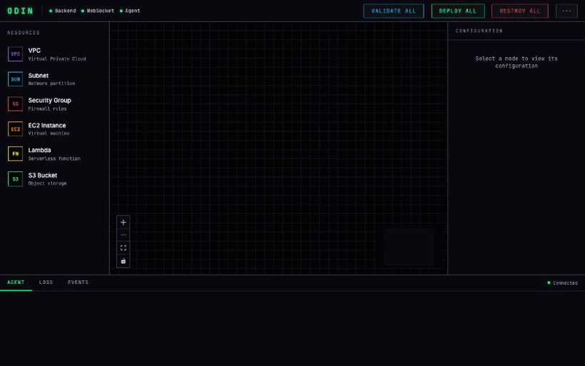

# Odin

[](LICENSE)
[](https://github.com/kessler-frost/odin/actions/workflows/ci.yml)


Odin is a local-first AWS: a drag-drop canvas where you design real AWS
architectures, an agent translates the canvas to Terraform/OpenTofu and back,
**Simulate** applies that through odin's own gateway onto real local
substitutes (RustFS for S3, and so on) at full API compatibility, and IAM
permissions drawn as edges on the canvas are enforced for real by odin's own
IAM engine. See [NORTHSTAR.md](NORTHSTAR.md) for the full direction this is
being built toward.



## What works today

- **Draw resources on the canvas.** Drop RDS, S3, SQS, SNS, and DynamoDB nodes
  and wire them together with `${{node.attr}}` references; config panel, drag/
  resize/connect, all through the real UI.
- **Apply runs it for real, locally.** A deterministic reconciler (observe →
  plan → execute) provisions RDS as a real Postgres container and the other
  AWS-shaped resources in real open-source backings — RustFS (S3), goaws (SQS
  + SNS), dynalite (DynamoDB) — run through [Colima](https://github.com/abiosoft/colima)
  (or inside a [Lima](https://lima-vm.io/) VM for isolation).
  No cloud account, no mocks.
  Errors and IAM checks are done at Apply time — Terraform generation and
  Simulate are in progress (see [Status](#status) below).
- **Supervised, with live status.** The reconciler watches health and
  reprovisions what crashes; every phase (starting / healthy / crashed / …)
  streams to the canvas over WebSocket.
- **Environments.** Multiple named environments reconcile independently, each
  with its own isolated AWS-shaped state.

## How it's built

- **UI:** React 19 + ReactFlow + Tailwind v4, served by Vite (`ui/`, `bun`).
- **Backend:** Python 3.12+ (`uv`), FastAPI + WebSocket, Pydantic.
- **Control loop:** a Spec Store (Stack = desired, World = observed) with a
  pure, idempotent `plan(Stack, World) → [Action]` reconciler that drives
  reality and verifies it with health assertions.
- **Runtime:** real containers via Colima (the default) or a Lima VM, behind a
  single `RuntimeDriver` protocol.
- **AWS-shaped resources:** RustFS (S3), goaws (SQS + SNS), dynalite
  (DynamoDB), and real Postgres (RDS) — provisioned per environment, run
  through the same runtime as everything else.

## Requirements

- Python 3.12+ and [uv](https://github.com/astral-sh/uv)
- [Colima](https://github.com/abiosoft/colima) for the container runtime (or
  [Lima](https://lima-vm.io/) for VM isolation)
- [bun](https://bun.sh/) — only for building the UI from a dev clone

## Install

Install the latest release (UI bundled in, no `bun` needed):

```bash
uv tool install git+https://github.com/kessler-frost/odin.git@latest
```

`latest` is a branch CI fast-forwards on every release, so this always tracks the
newest tagged version, not `main`.

Or from a local clone, for development:

```bash
git clone https://github.com/kessler-frost/odin.git
cd odin
uv tool install --editable ".[dev]"
cd ui && bun install
```

## Quick start

```bash
odin start            # build the UI and serve on http://localhost:4200
odin start --dev      # Vite HMR + uvicorn reload
```

```
odin start        Build UI + start the server
odin start --dev  Hot-reloading dev server
odin stop         Stop the server
odin status       Show running state
odin clean        Reset local state (odin clean --all wipes everything)
```

## Status

Odin is mid-pivot toward the local-first-AWS shape described in
[NORTHSTAR.md](NORTHSTAR.md): the canvas, environments, and RDS/S3/SQS/SNS/
DynamoDB on real substitutes work end to end today. The gateway, the
canvas↔Terraform translation agent, Simulate, and full IAM enforcement are in
progress — see [ROADMAP.md](ROADMAP.md) for the sequence.

The previous app-workload layer (services, dependencies, batch jobs, local
LLMs) has been parked — git tag `app-layer-parked` — while odin refocuses on
being an AWS-compatible core first; it may return as a layer on top later.

## Acknowledgements

Odin stands on the shoulders of open source giants — most of what makes it work is
other people's excellent work, and a lot of the thanks belongs to them:

- **[Colima](https://github.com/abiosoft/colima)** + **[Lima](https://lima-vm.io/)** — containers and VMs on the Mac
- **[PostgreSQL](https://www.postgresql.org/)** — the real backing for RDS
- **[RustFS](https://github.com/rustfs/rustfs)**, **[goaws](https://github.com/Admiral-Piett/goaws)**, **[dynalite](https://github.com/mhart/dynalite)** — the real backings for S3, SQS/SNS, and DynamoDB
- **[FastAPI](https://fastapi.tiangolo.com/)**, **[Pydantic](https://pydantic.dev/)**, **[boto3](https://github.com/boto/boto3)** — the backend
- **[React](https://react.dev/)** + **[React Flow](https://reactflow.dev/)** + **[Tailwind CSS](https://tailwindcss.com/)** + **[Vite](https://vitejs.dev/)** — the canvas UI
- **[uv](https://github.com/astral-sh/uv)** + **[bun](https://bun.sh/)** — the toolchain

Thank you to every one of these projects and their maintainers. 🙏

## License

Apache License 2.0. See [LICENSE](LICENSE).
