# odin — how it actually works

Every diagram here describes what runs, not what was planned. Where a claim could
not be measured it is named as unmeasured in [limits.md](limits.md) rather than
drawn as though it were proven.

GitHub renders these diagrams inline. For the ASCII forms used in the README,
`./scripts/render-diagrams.sh` regenerates them from `docs/diagrams/*.mmd`.

## The whole system

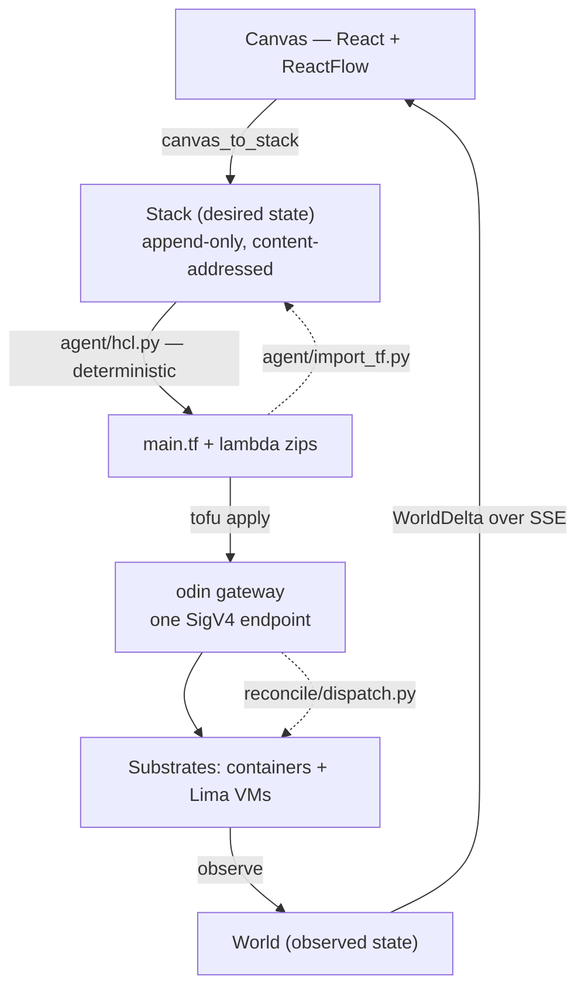

**Both translation directions are deterministic code.** The agent SDK sits behind
an off-by-default refine pass a guardrail can reject outright — it is
structurally incapable of deciding what gets applied. Status is a one-way
projection: drivers author facts, the reconciler emits a delta, the UI is a pure
view of it.

## Inside the gateway — every AWS call

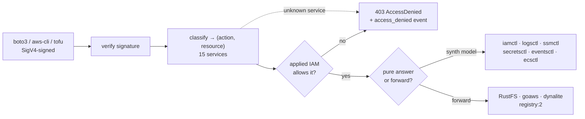

**Closed world.** A service the classifier does not know is a denial, not a
pass-through — which is why EventBridge could not be applied at all until its
classifier landed. Authorization reads the IAM that was *applied*, not the edges
you drew: a permission takes effect after an apply, never before.

## Per service — what is really underneath

### S3

`rustfs/rustfs — one container per env`

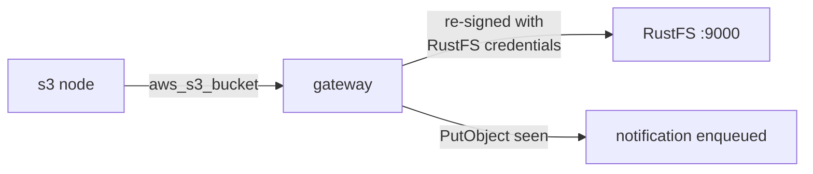

S3 is the one service whose forward is **re-signed** — RustFS enforces SigV4 itself. Bucket notifications are **synthesized by odin**: RustFS rejects every notification config and stores it anyway, so pass-through would fail the apply while a later plan read it back clean.

### RDS

`postgres:16-alpine + named volume + mesh`

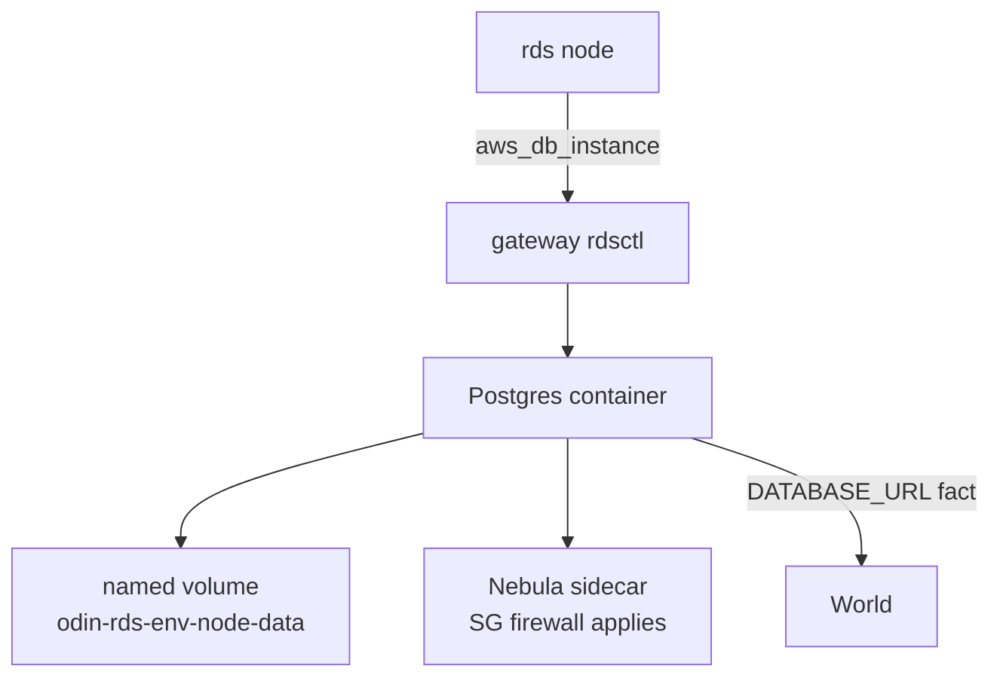

The volume is why a repair is **non-destructive**: `docker rm -f -v` deliberately does not remove a named volume, so a killed container comes back with its rows. The apply says whether the data survived by reading the real volume list, not by assuming.

### SQS & SNS

`admiralpiett/goaws — one container serves both`

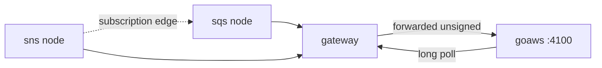

One process holds both, so **SNS→SQS fan-out is real delivery**, not a simulation. Long polling needed a derived timeout: goaws holds a poll about **1.5× the wait it is given** — measured 29.8–30.9s for a 20s wait, because each internal loop rescans the queue.

### Lambda

`public.ecr.aws/lambda/* — RIE, one warm container per function`

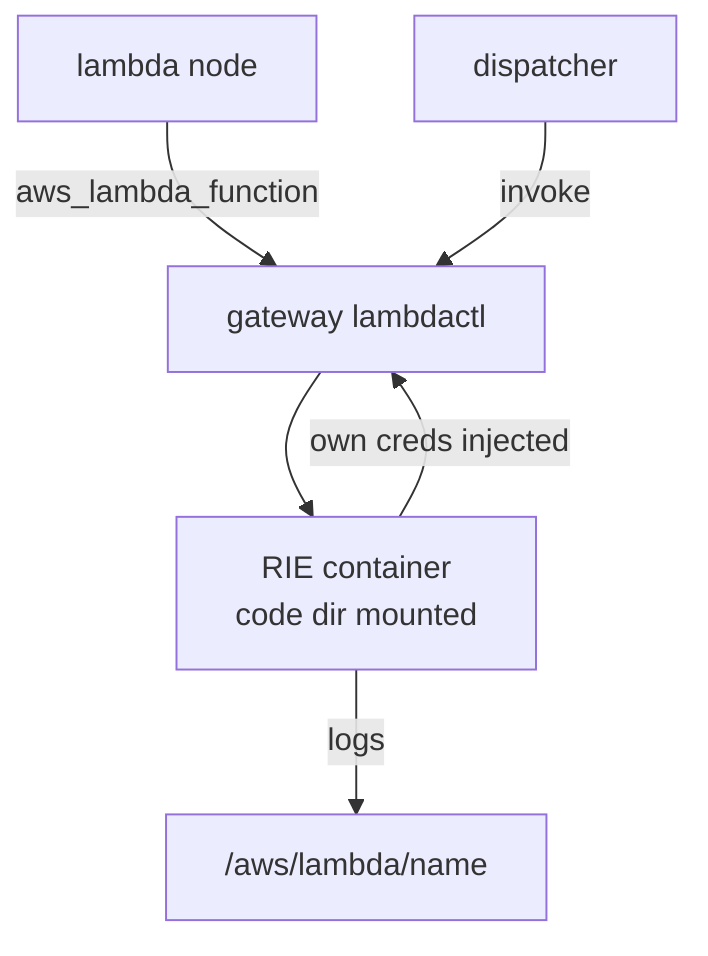

A function's own calls go back **through the gateway with its own credentials**, so its IAM is enforced on itself. Packaging takes a whole directory, and the archive is byte-deterministic — otherwise `source_code_hash` would churn and every plan would show a change.

### ECS

`Colima containers, one per task`

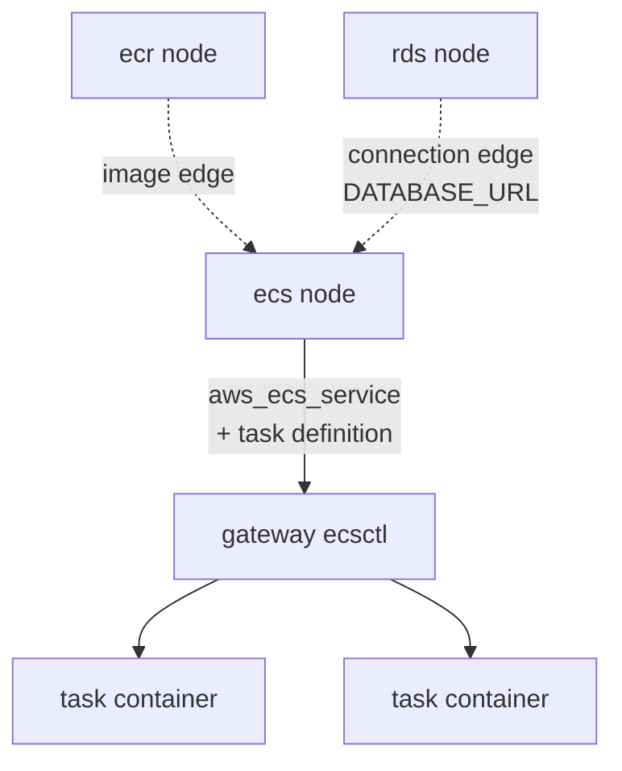

Rolling updates count only **current-revision** tasks as healthy — a waiter that counted stale ones would report a failed deploy as green. An `ecr` edge sets the image; a `connection` edge writes the endpoint into the container's environment at launch.

### EC2

`Lima VM, vzNAT, joined to the Nebula mesh`

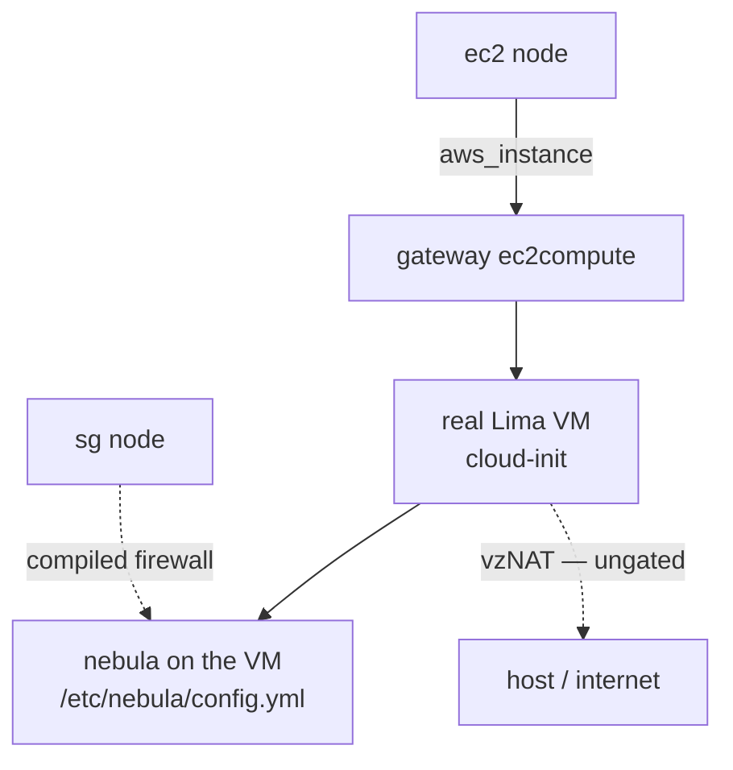

A real virtual machine, not a container pretending. Security groups gate **overlay traffic only** — the same VM whose overlay packet was just dropped can still reach the internet over vzNAT, which is stated rather than implied.

### VPC · Subnet · Security Group

`Nebula — a network per env, compiled firewall rules`

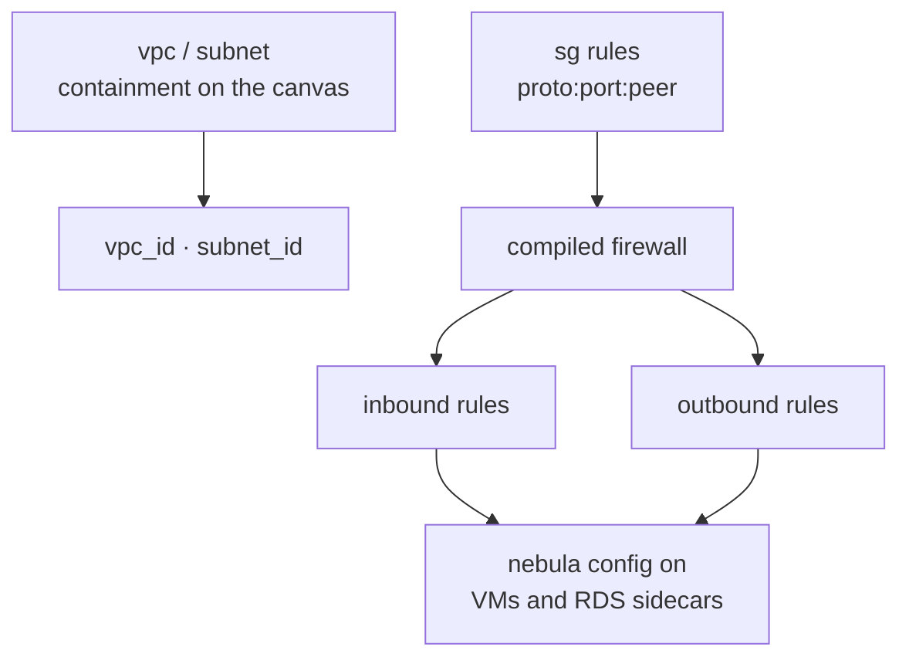

Geometry compiles to infrastructure: a node fully inside a VPC box gets its `vpc_id`. **Egress is enforced since v0.8.17** — it had been authored, planned and stored while gating nothing. Ports may be ranges; a single port is the degenerate case.

### ALB

`nginx container, dynamic host port`

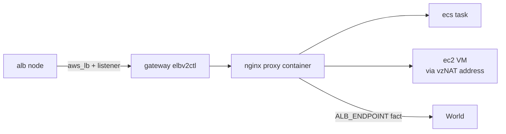

Targets resolve to a **real address**: an `i-…` target is looked up to the VM's own vzNAT IP — a container on Colima really can reach it, which was measured rather than assumed. The endpoint rides out as a fact because `DNSName` cannot carry a dynamic port.

### Event delivery

`reconcile/dispatch.py — one tick, three sources`

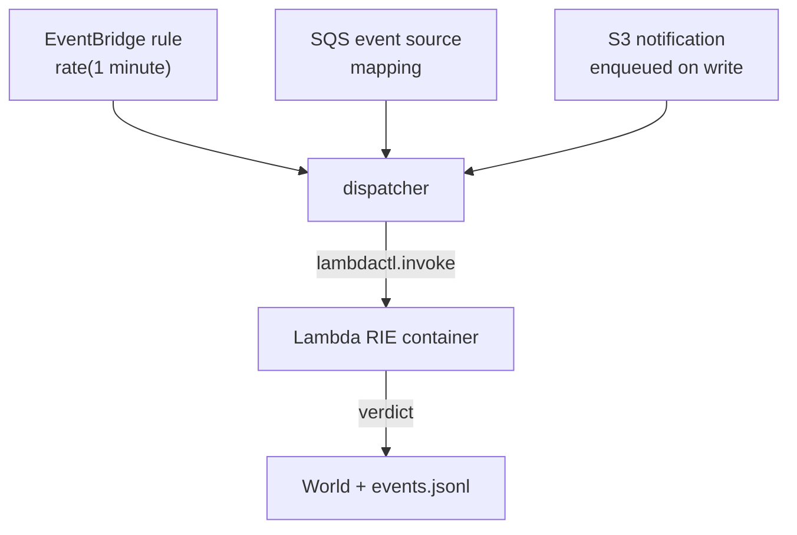

Real AWS's event source mapping *is* a poller, so odin polling is the actual architecture rather than a compromise. What cannot be delivered is **refused loudly** — pattern rules, cron, non-Lambda targets — because a trigger that applies clean and never fires is the worst failure available.

### DynamoDB · ElastiCache · ECR

`dynalite · redis:7-alpine · registry:2`

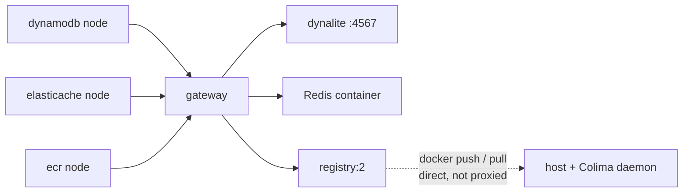

ECR's data plane is deliberately **not proxied** — a real `docker push` dials the registry's published port, and the daemon inside Colima can pull from it. Redis's wire protocol is not AWS-signed, so no IAM edge can gate a GET or SET; only its control plane is gated.

### IAM · Secrets · SSM · CloudWatch Logs

`JSON sidecars under .odin/<env>/gateway/`

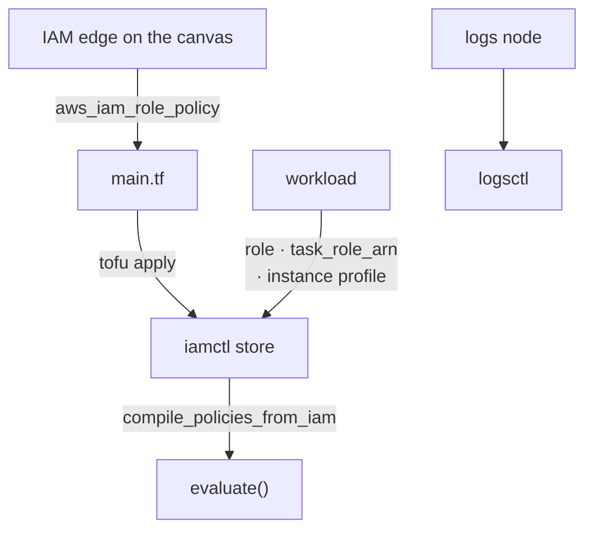

Each workload reaches its role through its **own service record** — a lambda's `role`, a task definition's `task_role_arn`, an instance's profile — never a naming convention. That is what makes a drawn permission take effect only after it is applied.

## Measured, not estimated

| | |
|---|---|
| scheduled rule → invoke | **60.5s**, once per period, on a real RIE container |
| goaws poll overhead | **1.5×** — 29.8–30.9s held for a 20s wait |
| gateway added latency | **~2ms** — verify → classify → evaluate → forward |
| integration suite | **86 tests**, three partitions, ~65 min total |

## The boundary, stated

The mesh gates overlay traffic and nothing else. ECS tasks, the ALB proxy, Lambda
containers and ElastiCache are not mesh members, so their egress is ungated
whatever group they are drawn into. A security group cannot stop a workload
reaching the internet over Colima/Lima NAT. Drawing those as gated would have
made a prettier diagram and a false one.
